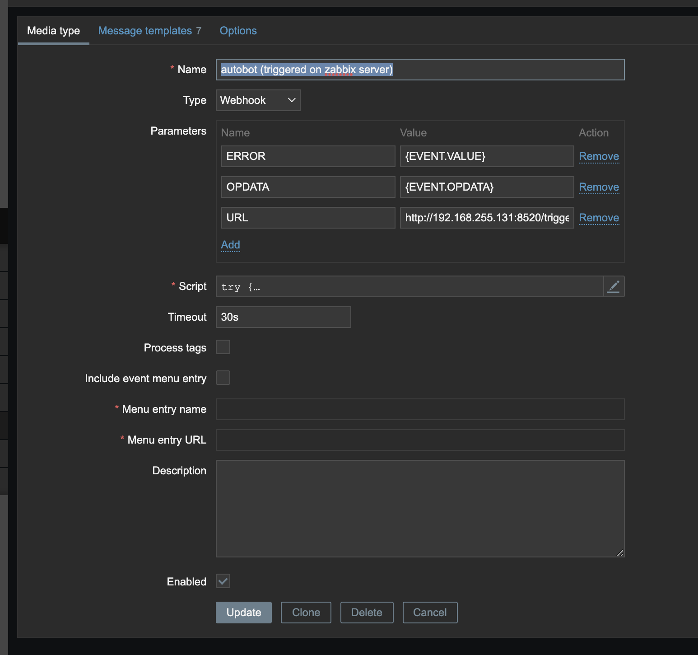
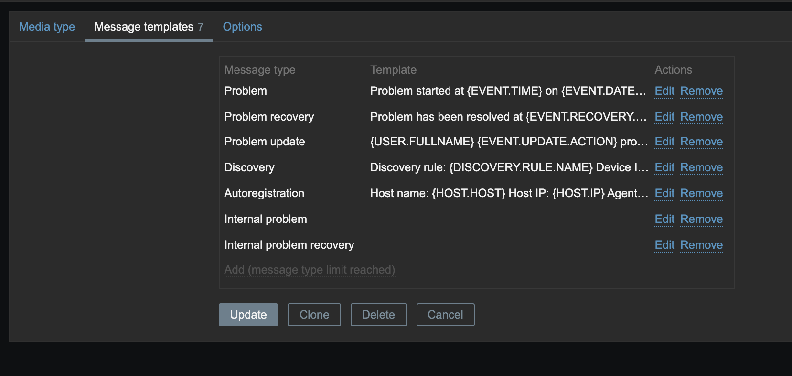
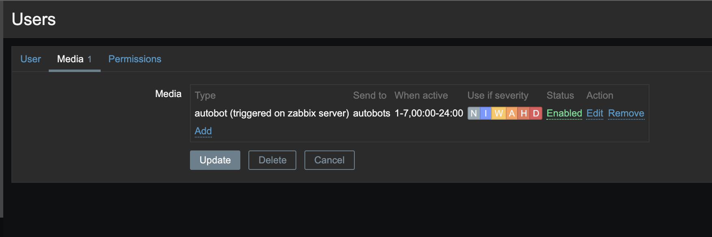
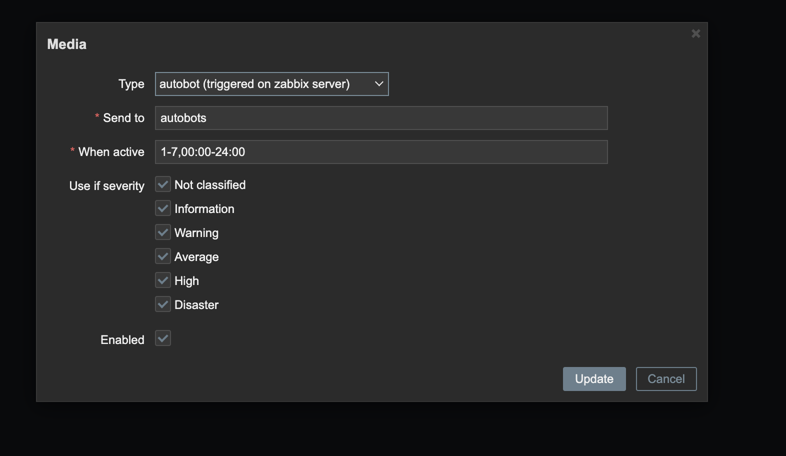

# Remote bot on machines to auto collect data *

* collect data
* execute triggers

## Setup

Recommended way is to use a virtual-env like:

```bash
# please use python3.9 or higher
python3.9 -m venv /var/lib/sre-bot
. /var/lib/sre-bot/bin/activate
pip install wheel
pip install sre-bot

# to install systemd service
sre install
```

### Completion for user root in bash

Per default ubuntu deactivates ~/.bashrc bash-completion. Uncomment the lines please.

## First steps

```bash
sre add-bot-path ./bots
sre new test-bot.py
```

## /etc/sre/sre.conf

```yaml
{
    "bots-paths": [
        "/home/sre/autobots/bots",
        "/home/sre/autobots/test-bots"
    ],
    "broker": {
        "ip": "address of mqtt broker",
        "port": 1883, # optional
    },
    "name": "myhost1",
    "log_level": "error"
    "log_file": "/var/log/sre/sre.log",
    # used for webhook trigger
    "http_address": "0.0.0.0",
    "http_port": 8520,
}
```

## Making a new bot

* `sre new my-bot1`

```python
HOSTNAME = "my-virtual-host1"   # optional otherwise configured default host
SCHEDULERS = ["*/10 * * * * *"] # optional - used when run is given up to seconds

def run(client):
    # requires SCHEDULERS!
    client.publish('house/bulb5', payload='off', qos=2)

def on_message(client, msg, payload=None):
    if '/restart/machine1' in msg.topic:
        ...

```

## Calling a webhook

* call http://address:port/trigger/mymachine/restart and a msg with topic "mymachine/restart" is sent
* useful together with zabbix

## Example: Zabbix Trigger

### Setup Zabbix

```javascript
// Insert this in the script section of mediatype webhook
try {
    Zabbix.Log(4, 'Autobot webhook: ' + value);
    var params = JSON.parse(value),
        req = new CurlHttpRequest(),
        resp;
    if (params.HTTPProxy) {
        req.setProxy(params.HTTPProxy);
    }
    req.AddHeader('Content-Type: application/html');
    resp = req.Post(params.URL, JSON.stringify(params));
    if (req.Status() != 200) {
        throw 'Response code: ' + req.Status();
    }
    return true;
}
catch (error) {
    Zabbix.Log(3, error);
    throw 'Failed with error: ' + error;
}

```







### Make a new bot

```python
import json

def on_message(client, msg, payload=None):
    if 'trigger/zabbix' in msg.topic:
        data = json.loads(msg.payload.decode('utf-8'))
        if data.get('OPDATA') == 'restart_queuejobs' and data.get("ERROR") == "1":
            client.publish("restart_queuejobs")
```

## Example: Setup Mosquitto for mqtt with docker

```yml
version: '3'
services:
  mosquitto:
      image: eclipse-mosquitto:1.6
      ports:
        - 1883:1883
      restart: unless-stopped
```

## install directly

pip3 install git+https://github.com/marcwimmer/sre-bot
